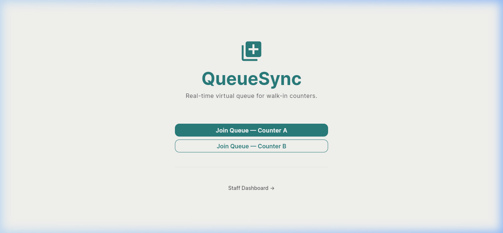
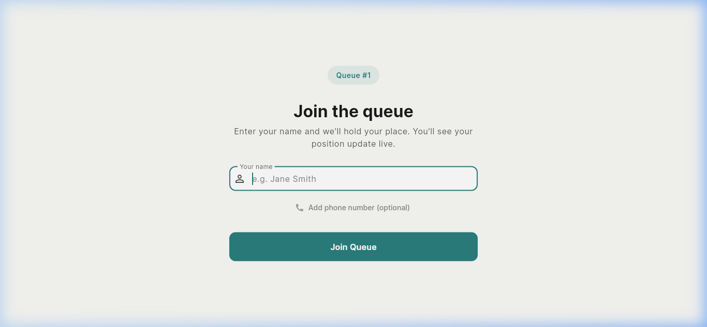
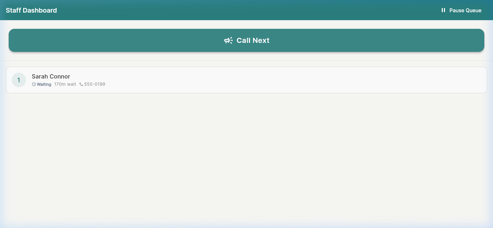

# QueueSync — Real-Time Virtual Queue Platform

[](https://github.com/Pradhyut21/Builder_base/actions/workflows/ci.yml)
[](https://serverpod.dev)
[](https://flutter.dev)
[](https://www.postgresql.org/)
[](LICENSE)

**QueueSync** is a high-reliability, real-time virtual queue management system engineered for walk-in service counters — medical clinics, municipal offices, student centers, and customer service desks. It eliminates physical crowding and anxiety by converting physical lines into interactive, live-updating mobile browser sessions.

---

## 📸 Real Application Screenshots

*Captured directly from the live, running QueueSync Serverpod backend and Flutter Web client.*

| 1. Counter Discovery & Selection | 2. Frictionless Visitor Entry |
|:---:|:---:|
|  |  |
| **Instant Access**: Zero app installs or account signups required. Visitors choose active counters via QR code or direct URL. | **Privacy-Preserving Form**: Clean validation with optional phone numbers. Visitor personal data never leaks across public streams. |

| 3. Live WebSocket Visitor Waiting Screen | 4. Authenticated Staff Counter Dashboard |
|:---:|:---:|
|  |  |
| **Real-Time Position Tracking**: Dynamic server-computed queue rank, contextual status alerts, and cryptographically bound `leaveQueue` token. | **Staff Operations Control**: Row-locked counter actions, instant "Call Next", queue pause enforcement, and automated session expiry. |

---

## 🎯 The Problem & Our Solution

Physical queues at walk-in counters are universally broken in three critical ways:
1. **Physical Congestion**: Visitors are forced to pack crowded waiting rooms solely to maintain their spot in line.
2. **Zero Transparency**: Printed ticket slips provide static numbers with no insight into real progress, service velocity, or remaining wait times.
3. **Turn Forfeiture**: Stepping away for water, childcare, or fresh air risks missing an announcement and forfeiting hours of waiting.

### The QueueSync Solution
- **Zero Friction**: Scan a QR code or tap a link (`/q/:counterId`). No app stores, no account passwords for visitors.
- **True Reactive Streaming**: Native bidirectional WebSockets via Serverpod streaming push position updates directly to visitors instantly without battery-draining polling timers.
- **Deterministic Concurrency**: Row-level database locks ensure two visitors hitting "Join" at the exact same millisecond never collide or receive ambiguous positions.
- **Fail-Safe Expiry**: Server-side durable FutureCalls automatically transition unresponsive tickets after 5 minutes, preventing stalled queues.

---

## ⚡ Why Serverpod (Load-Bearing Architectural Pillars)

QueueSync was built specifically to leverage the unique architectural strengths of the Serverpod 3.4 full-stack Dart framework:

| Serverpod Feature | Architectural Implementation in QueueSync | Source Reference |
|:---|:---|:---|
| **Real-Time Streaming (`postMessage` & `createStream`)** | Live visitor updates and staff queue feeds use native WebSocket streams. Zero `Timer.periodic` polling anywhere in the frontend or backend. | [`queue_endpoint.dart`](queuesync_server/lib/src/endpoints/queue_endpoint.dart)<br>[`staff_endpoint.dart`](queuesync_server/lib/src/endpoints/staff_endpoint.dart) |
| **ACID Transactions & Row Locking (`FOR UPDATE`)** | Parameterized `SELECT id FROM "counters" WHERE id = $1 FOR UPDATE` locks the counter during admissions, guaranteeing strict serialization and zero position drift. | [`queue_endpoint.dart:88`](queuesync_server/lib/src/endpoints/queue_endpoint.dart#L88) |
| **Durable FutureCalls** | Called entries automatically expire after 5 minutes using Serverpod FutureCalls stored in PostgreSQL, surviving server restarts and network interruptions. | [`entry_expiry_future_call.dart`](queuesync_server/lib/src/future_calls/entry_expiry_future_call.dart) |
| **Serverpod Native Auth IDP** | Built-in email authentication (`EmailSignInWidget`) secures the Staff Portal with session cookies and secure password hashing. | [`server.dart`](queuesync_server/lib/server.dart)<br>[`staff_login_screen.dart`](queuesync_flutter/lib/screens/staff/staff_login_screen.dart) |
| **Typed Domain Exceptions** | Clean, serializable typed exceptions (`CounterPausedException`, `ValidationException`, `UnauthorizedException`) instead of generic 500 HTTP errors. | [`models/exceptions/`](queuesync_server/lib/src/models/exceptions/) |
| **Privacy Redaction Engine** | Broadcast streams use server-side name redaction (`J*** D**`) and strip phone numbers, preventing data leaks across public visitor channels. | [`queue_endpoint.dart:255`](queuesync_server/lib/src/endpoints/queue_endpoint.dart#L255) |
| **Ownership Token Pattern** | `ownerToken` is generated with 256-bit cryptographically secure entropy and verified on `leaveQueue`, preventing malicious ticket cancellation. | [`queue_endpoint.dart:180`](queuesync_server/lib/src/endpoints/queue_endpoint.dart#L180) |

---

## 🏗️ Architecture & Data Flow

```
┌────────────────────────────────────────────────────────────────────────────────────────┐
│                                       QueueSync                                        │
│                                                                                        │
│   ┌──────────────────────────┐    WebSocket Stream    ┌────────────────────────────┐   │
│   │   Flutter Web Visitor    │◄──────────────────────►│      Serverpod Server      │   │
│   │   (/q/:counterId)        │  (Redacted Names, Pos) │                            │   │
│   └──────────────────────────┘                        │  queuesync_server/         │   │
│                                                       │  - QueueEndpoint           │   │
│   ┌──────────────────────────┐    WebSocket Stream    │  - StaffEndpoint           │   │
│   │   Flutter Web Staff      │◄──────────────────────►│  - EntryExpiryFutureCall   │   │
│   │   (/staff, /login)       │   (Full Queue Ops)     │  - Session Audit Logging   │   │
│   └──────────────────────────┘                        └─────────────┬──────────────┘   │
│                                                                     │                  │
│                                      PostgreSQL 16                  │                  │
│                        ┌────────────────────────────────────────────▼──────────────┐   │
│                        │ - counters (SELECT FOR UPDATE row-level lock)             │   │
│                        │ - queue_entries (deterministic joinedAt, id tiebreaker)   │   │
│                        │ - serverpod_future_call (persistent 5-min auto-expiry)    │   │
│                        │ - serverpod_auth_* (staff credentials & sessions)         │   │
│                        └───────────────────────────────────────────────────────────┘   │
└────────────────────────────────────────────────────────────────────────────────────────┘
```

### Monorepo Structure

```
queuesync/
├── .github/workflows/          # Consolidated CI & Automated Deployment Pipelines
│   ├── ci.yml                  # Unified format, analyze, server tests & flutter tests
│   └── deploy.yml              # Production deploy workflow
├── docs/images/                # Real captured application screenshots
│   ├── queuesync-home.png
│   ├── queuesync-join.png
│   ├── queuesync-waiting.png
│   └── queuesync-staff.png
├── queuesync_client/           # Auto-generated type-safe Dart client SDK
├── queuesync_flutter/          # Flutter Web application with Riverpod & GoRouter
│   ├── lib/screens/visitor/    # Visitor Join Form & Reactive Waiting Screen
│   ├── lib/screens/staff/      # Staff Counter Management & Serverpod Auth Login
│   └── lib/theme.dart          # WCAG AA compliant design token system
└── queuesync_server/           # Serverpod 3.4.13 backend
    ├── bin/seed.dart           # Counter seed script
    ├── config/                 # Environment configurations (development, test, passwords)
    ├── lib/src/endpoints/      # QueueEndpoint, StaffEndpoint
    ├── lib/src/future_calls/   # EntryExpiryFutureCall
    ├── lib/src/models/         # Counter, QueueEntry, and typed exceptions
    └── test/                   # Comprehensive unit & concurrent join integration tests
```

---

## 🔒 Concurrency & Data Integrity Guarantee

When multiple visitors submit admission requests concurrently, race conditions can cause double-booking or inaccurate position allocation. QueueSync eliminates this using a two-tier database safeguard:

1. **Row-Level Counter Locking**:
   ```dart
   // queuesync_server/lib/src/endpoints/queue_endpoint.dart
   await session.db.unsafeQuery(
     'SELECT id FROM "${Counter.t.tableName}" WHERE id = $1 FOR UPDATE;',
     parameters: QueryParameters.positional([counterId]),
     transaction: transaction,
   );
   ```
   Every admission request acquires an exclusive row-level lock on the target Counter record. Concurrent transactions hitting the same counter block cleanly until the preceding transaction commits.

2. **Deterministic Secondary Tie-Breaker**:
   ```dart
   // Primary order by joinedAt timestamp; secondary tie-breaker by auto-increment id
   orderDescending: false,
   orderByList: (t) => [
     Order(column: t.joinedAt, orderDescending: false),
     Order(column: t.id, orderDescending: false),
   ],
   ```
   Even if two system clocks record identical microsecond timestamps, database primary key sequence numbers guarantee deterministic order.

---

## 🚀 Running Locally

### Prerequisites
- **Dart SDK**: `3.10.3`
- **Flutter**: `3.38.4` (channel stable)
- **PostgreSQL**: `16` (running on port `5432`)
- **Serverpod CLI**: `serverpod_cli 3.4.13`

### 1. Clone & Setup Workspace
```bash
git clone https://github.com/Pradhyut21/Builder_base.git
cd queuesync
dart pub get
```

### 2. Configure Database & Passwords
Ensure PostgreSQL is active, then create the development and test databases:
```bash
# Connect with psql
psql -U postgres -h localhost -p 5432 -c "CREATE USER queuesync_user WITH PASSWORD 'qSyncDevDb_9xK8mN2vP4wR7tY1aE3z';"
psql -U postgres -h localhost -p 5432 -c "CREATE DATABASE queuesync OWNER queuesync_user;"
psql -U postgres -h localhost -p 5432 -c "CREATE DATABASE queuesync_test OWNER queuesync_user;"
```

Configure credentials in [`queuesync_server/config/passwords.yaml`](queuesync_server/config/passwords.yaml) (gitignored, template provided in `.env.example`):
```yaml
development:
  database: 'qSyncDevDb_9xK8mN2vP4wR7tY1aE3z'
test:
  database: 'qSyncTestDb_8tY1aE3zB5dG7jL9kM2n'
```

### 3. Apply Migrations & Seed Demo Counters
```bash
cd queuesync_server

# Apply schema migrations
dart run bin/main.dart --apply-migrations

# Seed demo counters ("Clinic Counter A", "Government Services Counter B")
dart run bin/seed.dart
```

### 4. Start Serverpod Backend
```bash
dart run bin/main.dart
```
The server starts up and binds to:
- **API Server**: `http://localhost:8080`
- **Insights Server**: `http://localhost:8081`
- **Web Server**: `http://localhost:8082`

### 5. Launch Flutter Web Frontend
In a new terminal window:
```bash
cd queuesync_flutter
flutter run -d chrome
# or: flutter run -d web-server --web-port 8085
```
Navigate your browser to:
- **Home Hub**: `http://localhost:8085/#/`
- **Visitor Screen**: `http://localhost:8085/#/q/1`
- **Staff Dashboard**: `http://localhost:8085/#/staff`
- **Staff Login**: `http://localhost:8085/#/login`

---

## 🧪 Automated Test Suite

QueueSync maintains strict testing standards across unit, widget, and concurrent integration tests:

```bash
# 1. Run Serverpod Backend Test Suite (including concurrent join serialization)
cd queuesync_server
dart test

# 2. Run Flutter Client Widget & Logic Tests
cd ../queuesync_flutter
flutter test

# 3. Static Code Analysis (0 warnings, 0 infos policy)
dart analyze --fatal-infos
flutter analyze
```

### Concurrency Test Coverage
[`queuesync_server/test/concurrent_join_test.dart`](queuesync_server/test/concurrent_join_test.dart) simulates 10 visitors joining the same counter at the exact same millisecond using `Future.wait`:
- Verifies all 10 transactions succeed without deadlocks.
- Asserts strict monotonic sequence of positions `1` through `10`.
- Validates that zero duplicate positions or dropped admissions occur.

---

## 🛡️ Security & Privacy Architecture

- **Committed Secrets Scrubbed**: Zero hardcoded passwords or API keys are committed to Git. All environments consume credentials via environment variables or secret managers.
- **Visitor Privacy Redaction**: Public WebSocket streams broadcast only redacted visitor initials (`S**** C*****`). Phone numbers are strictly server-confidential and never broadcast.
- **SQL Injection Prevention**: All dynamic queries use positional parameters (`QueryParameters.positional([counterId])`).
- **Owner Token Isolation**: `ownerToken` is stored in client browser storage and strictly verified on cancellation, preventing third-party queue tampering.

---

## 👥 Hackathon Team

- **Full-Stack Engineering & Architecture**: End-to-end Serverpod backend, Flutter web client, concurrency locks, test suites, and CI/CD pipelines.

---

## 📄 License

This project is licensed under the MIT License — see the [LICENSE](LICENSE) file for details.
